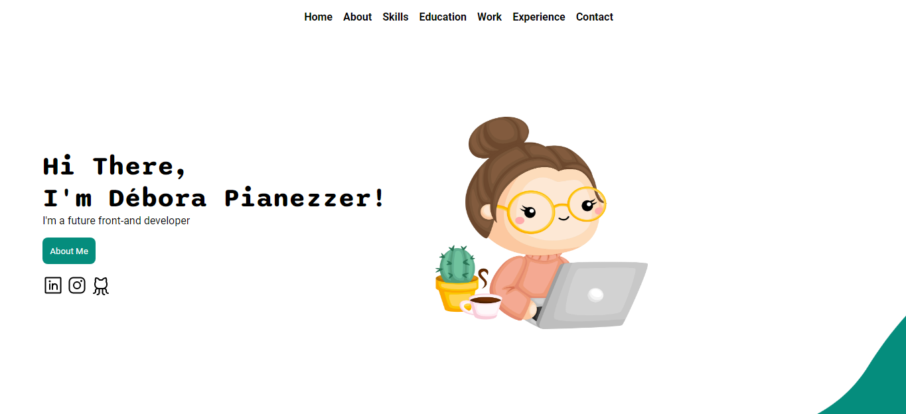

<h1 align="center">Portfolio </h1>

  <a href="#-technologies">Technologies</a>&nbsp;&nbsp;&nbsp;|&nbsp;&nbsp;&nbsp;
  <a href="#-project">Project</a>&nbsp;&nbsp;&nbsp; &nbsp;&nbsp;&nbsp;

 

   

## 🚀 Technologies

This project was developed with the following technologies:

- HTML e CSS
- JavaScript 
- Git e Github

## 💻Project

This project in my portfolio is for, at the moment, practicing my study of HTML5, CSS3 and JavaScript.

